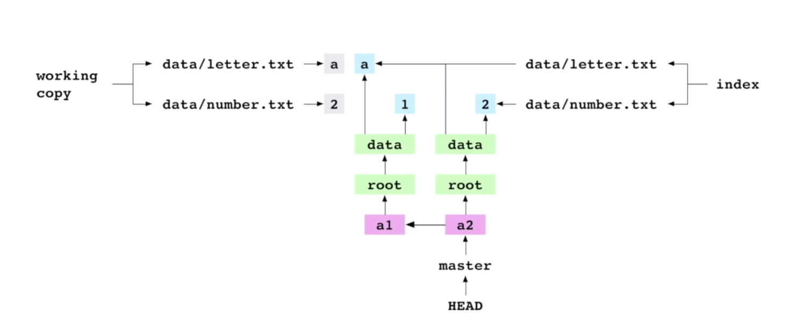

# Deep dive Git

Hare are my notes from this brilliant talk: [Git from the inside out, Mary Rose Cook](https://youtu.be/fCtZWGhQBvo)

I also used this [interactive git simulation](https://git-school.github.io/visualizing-git/#free) as a visual aid.

## Setup

Let's use an example git repo. The contents of the `.git` directory looks like this:

```bash
$ tree -a .git
.git
├── COMMIT_EDITMSG
├── HEAD
├── config
├── description
├── hooks
│   ├── applypatch-msg.sample
│   ├── commit-msg.sample
│   ├── fsmonitor-watchman.sample
│   ├── post-update.sample
│   ├── pre-applypatch.sample
│   ├── pre-commit.sample
│   ├── pre-push.sample
│   ├── pre-rebase.sample
│   ├── pre-receive.sample
│   ├── prepare-commit-msg.sample
│   └── update.sample
├── index
├── info
│   └── exclude
├── logs
│   ├── HEAD
│   └── refs
│       ├── heads
│       │   └── master
│       └── remotes
│           └── origin
│               └── HEAD
├── objects
│   ├── 23
│   │   └── d5569d6a05ab7cf86b3dc8877a8f12f41307a6
│   ├── 43
│   │   └── 5343c9192ae8790d4056df7daa5df68478461d
│   ├── 48
│   │   └── 082f72f087ce7e6fa75b9c41d7387daecd447b
│   ├── 4a
│   │   └── 31389fcccd7e093e5de6c1c7e7120d89f59411
│   ├── 58
│   │   └── 14b06a77320d107dc8fd6b57c95d4b861e0b11
│   ├── 5c
│   │   └── d2a71b47e92df1a8d60c03c42a3eeab2dda0be
│   ├── 81
│   │   └── c545efebe5f57d4cab2ba9ec294c4b0cadf672
│   ├── info
│   └── pack
│       ├── pack-2de867e6fdd01c2f013836e9d5591b1d9bf0eaf0.idx
│       └── pack-2de867e6fdd01c2f013836e9d5591b1d9bf0eaf0.pack
├── packed-refs
└── refs
    ├── heads
    │   └── master
    ├── remotes
    │   └── origin
    │       └── HEAD
    └── tags

22 directories, 32 files
```

## `git add`

When running `git add`, Git does the following:

### 1. Create blob objects

For each added file, git computes a 40-character hash of the _whole file contents_. (Note that you can uniquely reference the hash by its first 7 characters, it will still be unique.()

To compute the hash, given the file path:
```bash
$ git hash-object scholarly/scholarly.py
435343c9192ae8790d4056df7daa5df68478461d
```

To compute the file contents, given the hash:
```bash
$ git cat-file -p 435343c9192ae8790d4056df7daa5df68478461d
# pretty-printed plaintext contents
```

Then, git uses this hash to create a 'blob' object under `.git/objects`. The file name will be the computed hash.

Or rather, the first 2 characters of the hash will be used as the subdirectory name.

Here is how a blob with hash `4353...` will be placed under `objects/`:
```bash
├── objects
│   ├── 43
│   │   └── 5343c9192ae8790d4056df7daa5df68478461d
```

Note that we cannot read the blob file directly, because it is encrypted. (?)
```bash
$ file -b .git/objects/0c/5f9568aa0f39697cb53777dcf8b25817b21f54
zlib compressed data
```

### 2. Update the index

After an add, git updates the _index_, i.e. the index of files that are currently under version control.

The index points to the hashes of the blobs stored in the `objects/` directory at the moment of running `git add`.

To see the files listed in the index:
```bash
$ git ls-files -s
100644 773296331ea6fdd08ad549d15c9036304af71196 0	.gitignore
100644 68a49daad8ff7e35068f2b7a97d643aab440eaec 0	LICENSE.txt
100644 1a86582f48dde89807dc3d90bb97bb13c6c10e54 0	README.md
100644 02a19cad912cd02845a4eb6942ca4796af78dfb2 0	requirements.txt
100644 23aa1db03c9334fac9807df01bbcf9b42770c9d8 0	scholarly/__init__.py
100644 435343c9192ae8790d4056df7daa5df68478461d 0	scholarly/scholarly.py
100644 b9976c06baecd63a03a2a88eb1f0c679a670e670 0	scholarly/test.py
100644 0c3e0e8505528ade0922e758f18b8019b612687c 0	setup.py
```

So effectively, **the index stores the exact same data as the working copy**!

**Note** that each time I modify a file or even do `git rm`, the blob still remains in the `objects/` directory. However, if it is not staged, it will not be referenced in the index.

## `git commit`

When running `git commit`, Git does the following:

### 1. Create a commit object

Commits are also objects that are given a hash and added to the `objects/` directory.

A commit object stores both:
- Metadata about the commit (author, timestamp, message)
- The actual contents of the working copy at the time of the commit! (i.e. the index)

To inspect the contents of a commit, you can use the same command `cat-file -p`:
```bash
$ git cat-file -p 4a31389
tree 5814b06a77320d107dc8fd6b57c95d4b861e0b11
parent d1e0d8263594323b677ba5191a64606d8b532bd2
author Your Name <you@example.com> 1595013465 +0200
committer Your Name <you@example.com> 1595013465 +0200

my commit message
```

where:
- `tree` is an object that represents the contents of the index upon commit (see more below)
- `parent` points to the previous commit object in the commit graph

After a commit is created, git creates a graph of the contents of the index _at the moment of the commit_. And this graph can represent the actual directory structure of the working copy (which is otherwise flattened by the hash representation in the `objects/` directory).

If we inspect the 'tree' object referenced in the commit:

```bash
$ git cat-file -p 5814b06
100644 blob 773296331ea6fdd08ad549d15c9036304af71196	.gitignore
100644 blob 68a49daad8ff7e35068f2b7a97d643aab440eaec	LICENSE.txt
100644 blob 1a86582f48dde89807dc3d90bb97bb13c6c10e54	README.md
100644 blob 02a19cad912cd02845a4eb6942ca4796af78dfb2	requirements.txt
040000 tree 5cd2a71b47e92df1a8d60c03c42a3eeab2dda0be	scholarly
100644 blob 0c3e0e8505528ade0922e758f18b8019b612687c	setup.py
```

we see that the entries are either of type 'blob' or 'tree'. Each **blob** object references the file contents of a file in the working copy, while each **tree** object references the contents of a directory in the working copy.

### 2. Update the branch ref and HEAD

If needed, git will update the text file `.git/HEAD` to point to the current branch that we have committed to.

```bash
$ cat .git/HEAD
ref: refs/heads/master
```

And the file `.git/refs/heads/master` itself contains the hash of this last commit we made on master:

```bash
$ cat .git/refs/heads/master 
4a31389fcccd7e093e5de6c1c7e7120d89f59411
```

This means that `HEAD` is just a pointer to ref `master`, and `master` is just a pointer to our latest commit.

And the fact that `HEAD` points to `master`, is what tells us that **we are currently on the master branch** (i.e. we have checked out master).



----
#### Takeaways

- **Content is stored as trees**: if a file has not changed since the previous commit, the commit object will store the reference to the existing blob, without creating a new one.
- **Each commit has a parent**: git can 'unwind' the chain of commit references to reconstruct the whole history of the repository
- **Refs are entry points to the commit history**: refs like 'master' and 'HEAD' are just aliases or mnemonics that refer to commits at a given moment
- **Objects are immutable**: modifications to files create a new blob, and the old blob is never deleted
- **Refs are mutable**: their meaning can change

----

## `git checkout`

If we try to check out a _commit_, we get in a state called **detached HEAD**. This just means that we've checked out a commit instead of a branch.

Git will show us this warning:

```bash
$ git checkout 4a31389
M	LICENSE.txt
M	README.md
A	example.txt
M	scholarly/__init__.py
Note: checking out '4a31389fcccd7e093e5de6c1c7e7120d89f59411'.

You are in 'detached HEAD' state. You can look around, make experimental
changes and commit them, and you can discard any commits you make in this
state without impacting any branches by performing another checkout.

If you want to create a new branch to retain commits you create, you may
do so (now or later) by using -b with the checkout command again. Example:

  git checkout -b <new-branch-name>

HEAD is now at 4a31389 my commit message
```

And if we cat the HEAD file, we see that it is pointing now directly to the commit, instead of the master branch ref:

```bash
$ cat .git/HEAD
4a31389fcccd7e093e5de6c1c7e7120d89f59411
```

When running `git checkout`, Git does the following to 'restore' the state of the desired commit:

1. Write the commit's content to the working copy (if we are already on the commit, then there's no work to do)
2. Write the commit's content to the index
3. Point HEAD to the current ref or commit


## `git branch`

When we create a branch, git will create a new ref under `.git/refs/heads` which contains the hash of the current HEAD commit.

So wherever out current HEAD is, when we create a new branch, the branch will point to that commit.

**Branches are refs, which are just files storing the latest commit hash**. So they are very lightweight!

## `git merge`

When we merge a branch, we 'bring in' the changes _from_ that branch _into_ our current branch.

4 scenarios:

### 1. Merge an ancestor into a descendent

When we merge a branch that is pointing to a previous commit in our own branch's lineage, then git will **do nothing**!

Why? Because the commit history of our current branch _already_ includes the ancestor.

Remember: **a commit `c` is the set of changes that brings us from state `s(c-1)` to state `s(c)`.**

### 2. Merge a descendent into an ancestor

Here, git will by default to a **fast-forward merge**.

When merging, Git needs to represent the set of changes that brings us from state `s(c-1)` to state `s(c)`. But that state of changes already exists, and it is exactly the commit `c`!

So to merge, git will not create any new commits or change the history in any way. It will just change the commit hash of our current branch ref to point to the descendent's HEAD.

### 3. Merge two commits from different lineages

In this case, the two branches diverged, but changes were made to _different_ files.

The outcome of a merge is a _merge commit_, which joins the two lineages.

The resulting merge commit will have two parents! But git will also be able to find out the **base commit** of the merge, that is, the last common parent before the lineages diverging.

How does git compute merge?
1. Generate the **diff** that combines the changes made by the receiver and giver (starting from the base commit). -> As long as each file _only_ changed in the receiver _or_ the giver, git is able to automatically resolve the merge.
2. Apply the diff to the working copy
3. Apply the diff to the index (by computing the hash of the new content after applying diff)
4. Commit the updated index -> and the merge commit will have 2 parents!
5. Point HEAD and the branch ref to the new commit

```bash
$ git cat-file -p 629d191
tree d5af65a5ee5803eea0352f8718770032085a62e9
parent 02b34aba85859d010e8df7a2cc24f49ec6df9009
parent 0509aa11530efa0c7d34291ab2a6f7d68eedccb2
author Your Name <you@example.com> 1595075554 +0200
committer Your Name <you@example.com> 1595075554 +0200

Merge branch 'master' into dev
```

### 4. Merge two commits from different lineages, where both commits modify the same file

Here, git cannot use any algorithms for computing the merge automatically.

So it will indeed start the merge, but then give this warning:

```bash
$ git merge master
Auto-merging README.md
CONFLICT (content): Merge conflict in README.md
Automatic merge failed; fix conflicts and then commit the result.
```

And `git status` will return:
```bash
$ git status
On branch dev
You have unmerged paths.
  (fix conflicts and run "git commit")
  (use "git merge --abort" to abort the merge)

Unmerged paths:
  (use "git add <file>..." to mark resolution)

	both modified:   README.md
```

So resolving the merge conflict is left to the user.

However, git has actually started the merge (although still with unresolved conflicts), without yet creating a commit for it.

If we look at the index:

```bash
$ git ls-files -s
100644 773296331ea6fdd08ad549d15c9036304af71196 0	.gitignore
100644 0c5f9568aa0f39697cb53777dcf8b25817b21f54 0	LICENSE.txt
100644 a55ef187afe60c722e0d2eb22e157fb2af51c6f7 1	README.md
100644 8068027f968e3be18a2102b64a94c997318ebdd1 2	README.md
100644 4f2c43603dd2f4b3a3855fe9a659d998e8beb08f 3	README.md
100644 33a9488b167e4391ad6297a1e43e56f7ec8a294e 0	example.txt
...
```

The numbers 1, 2, 3 (differing from typical 0) are the **stages**.

If the stage is equal to 0, then this means no conflict. The other 3 stages of the `README.md` file represent the different conflicting versions of the file, each with its own hash (and respective blob stored in the `objects/` database).

The presence of these 3 stages is what tells git that the file `README.md` has a conflict.

So what does the user need to do to resolve the conflict?

1. Modify the file in the working copy, based on desired outcome
2. Resolve the conflict in the index by running `git add` -> this tells git that the conflict has been resolved.

If we look at the index after `git add`, there will be again a single entry for the file with stage 0. The object hash will point to the newly added blob:

```bash
$ git ls-files -s
...
100644 2ccc849b96b510a50d9155819c4e5d9291a69a55 0	README.md
...
```

And `git status` will prompt us to commit the resolved merge conflict:

```bash
$ git add README.md 
$ git status
On branch dev
All conflicts fixed but you are still merging.
  (use "git commit" to conclude merge)

Changes to be committed:

	modified:   README.md
```

3. Commit the merge -> again, the commit will store both references to both pre-merge parents:

```bash
$ git cat-file -p 4338f39
tree ccc26582ce2cedc9fc56ef56bd58af55411b90cc
parent eddcc662deb27366bc234913bf0abd03bde4ffaf
parent be18607c65aec52a79770501c9fb0a1fd742cf7b
author Your Name <you@example.com> 1595077424 +0200
committer Your Name <you@example.com> 1595077424 +0200

resolve conflicts
```

## `git rm`

When you run `git rm` for a file, git does the following:

1. Delete the file from the working copy (filesystem)
2. Remove the file from the index
3. User must commit the removal -> when inspecting the commit, the file will not be listed in the commit's index content

## `git fetch`

In git, change history can be shared between repositories.

Repositories store remote refs by recording locally the state of a branch in the remote repositories. Remote refs are updated by running `git fetch`.

Information about linked remote repositories is store in the `.git/config` file:

```bash
$ cat .git/config 
[core]
	repositoryformatversion = 0
	filemode = true
	bare = false
	logallrefupdates = true
	ignorecase = true
	precomposeunicode = true
[remote "origin"]
	url = https://github.com/davide-coccomini/scholarly.git
	fetch = +refs/heads/*:refs/remotes/origin/*
[branch "master"]
	remote = origin
	merge = refs/heads/master
```

### Difference between `git fetch` and `git pull`

`git fetch` + `git merge FETCH_HEAD` = `git pull`

So `git fetch` already downloads the references and objects of the remote HEAD (already copying the files to the working copy in the filesystem), but keeps the local HEAD fixed.

Whereas `git pull` additionally merges the upstream changes into the current commit (which is usually a fast-forward merge) and updates the local HEAD and branch ref to point to the merged fetch commit.

## `git clone --bare`

A bare repository has **no working copy**, and contains all contents usually in the `.git` subdirectory in its top-level directory.

This way, it is possible to do `git push` to the bare remote, without git warning about potentially overwriting someone else's uncommitted changes!

So all **remote repositories are bare**: you never commit directly to them, you can only push or pull!
