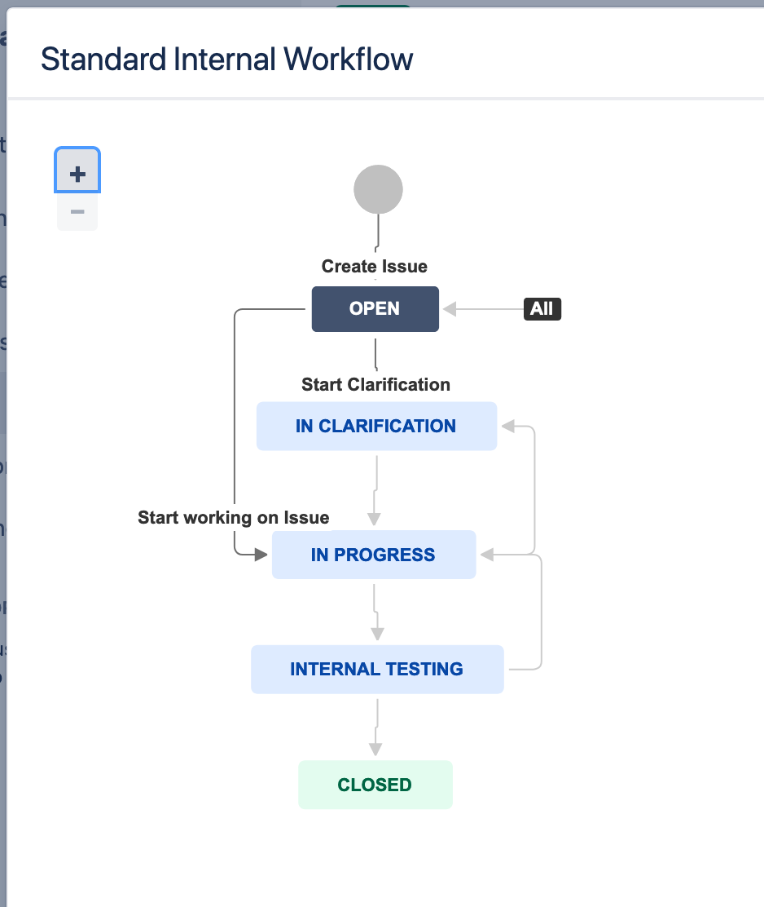

# How to (not) display a Jira workflow on a Confluence page

The idea was simple: creating a documentation page in Confluence for a particularly gnarly Jira workflow.

The page should automatically pull data from Jira (because hey, we have an Application Link established between the instances!) and display an interactive view of the workflow diagram, just like you would see on a Jira issue by clicking on 'View Workflow':



Turns out recreating the workflow view was pretty easy using purely client-side Javascript. Jira ships with a [ready-made Javascript component](https://developer.atlassian.com/server/jira/platform/implementing-the-jira-workflow-designer/) for rendering a workflow viewer in the browser. Pack it in a Scriptrunner custom REST endpoint, and the interactive viewer for a given workflow can be opened in Jira at the click of a URL.

However, **embedding the Javascript in Confluence turned out to be the real struggle**! In attempting this, I learned a bit about how browsers and servers negotiate access to cross-origin resources. Although proving fatal for my workflow-doc implementation, these restrictions are essential for preventing nasty security attacks such as cross-site scripting (XSS).

**TL;DR**: as of July 2020, I do not believe this implementation to be possible without using third-party add-ons or developing your own Gadget plugin. See the Workarounds section below for some alternatives.


## The trouble with cross-origin HTTP requests

Here is the scenario. Our browser has loaded a Confluence page at `https://confluence.mydomain.com`. This is our current _origin_, defined by a triplet of scheme-host-port:

- Scheme: HTTPS
- Host: `confluence.mydomain.com`
- Port: 443 (default HTTPS port)

On the Confluence webpage, I have added an `<iframe>` HTML element where I want the interactive workflow diagram to be embedded. Here, custom Javascript should fetch and display the workflow from my company's Jira site at `https://jira.mydomain.com`. Note that this is a subdomain of the same `mydomain.com` domain, so the request is *same-site* but *cross-origin* (remember: origin = scheme + host + port).

It should be that easy to embed content from other sites, right? Especially if Jira and Confluence are running on the same domain, and are linked with an Application Link. For sure they should trust each other's content by default.

And yet... When loading the page, the iframe section is blank, and we get an error message in the browser with a big red 🚫'blocked' sign.

What went wrong?

## Problem 1: the Same-Origin Policy

### The Same-Origin Policy in action

Despite the error message about blocking, our GET request *is in fact sent* by the browser to the Jira server<sup>[1](#footnote1)</sup>.

The request contains a very important HTTP header called `Origin`<sup>[2](#footnote2)</sup>. This tells the Jira server from which origin a script is trying to load its resources.
```
Origin: https://confluence.mydomain.com
```

Alongside the `Origin` header, the browser will also send a set of 'fetch headers' with additional details (experimental, only in Chromium as of v81):
```
Sec-Fetch-Dest: empty
Sec-Fetch-Mode: cors
Sec-Fetch-Site: same-site
```

_After_ receiving the server's response, the browser will **by default** block access to the resource with the infamous error message logged in the console:
```
Access to fetch at 'https://jira.mydomain.com/' from origin 'https://confluence.mydomain.com' has been blocked by CORS policy: No 'Access-Control-Allow-Origin' header is present on the requested resource.
```

This default blocking behaviour is called the **Same-Origin Policy**. It simply says: in absence of further information, the browser will only allow scripts to read 'protected' resources from the same origin. (Note that the policy is relaxed for some types of cross-origin resources, such as images or CSS links, or for POST requests.)

How do we prevent this blocking, and _who_ is in the position to prevent it?

### Enter Cross-Origin Resource Sharing (CORS)

Cross-Origin Resource Sharing (CORS) is the way to force the browser to make exceptions to the Same-Origin Policy. In CORS, the power to unblock a request is in the hands of the **target server**, in this case Jira.

If Jira wants to allow Confluence to request its resources from scripts, the Jira server must send back an `Access-Control-Allow-Origin` header which includes the Confluence origin<sup>[3](#footnote3)</sup>. Only then, the browser will not block the response.

This ensures that **Jira is consenting to 'sharing' its resources with Confluence**.

Note that if we have an Application Link established between the two instances, most public Jira REST API endpoints already implement CORS with the linked Confluence. This is configured by default in the [Whitelist](https://confluence.atlassian.com/conf613/configuring-the-whitelist-964961458.html) in the admin UI. For example, check out the response headers of this (unauthenticated) GET request to Jira:

```
GET https://jira.mydomain.com/rest/api/latest/serverInfo

HTTP/1.1 200 
Access-Control-Allow-Origin: https://confluence.ad.meelogic.com
Access-Control-Allow-Credentials: true
Access-Control-Expose-Headers: Origin
```

Great! So to allow CORS for my custom REST endpoint, I just needed to add the CORS headers to the response. That solved the CORS issue, and I no longer got the error message in the browser console.

However, the browser was still blocking the request. This time, the iframe panel was greyed out with the message:

```
Blocked by Content Security Policy
Firefox prevented this page from loading in this way because the page has a content security policy that disallows it.
```

## Problem 2: Content Security Policy (CSP) for iframes

Content Security Policy (CSP) can work in tandem with CORS to control access to resources. It is a more general way for a server to dictate which _types of resources_ (scripts, images) can be loaded in what _contexts_ (iframes, inline) and from which _origins_.

In our scenario, let's we are the admins of the Jira server. We want to instruct the browser to only load content that we know actually comes from our website, and was not injected by some third party. To do this, we make our server send out the `Content-Security-Policy` response header, containing the rules about what the browser should block and what it should allow when requesting our site.

Let's see what Jira's CSP looks like when calling the `viewWorkflowDiagram` endpoint in the browser, which would embed the workflow viewer Javascript:

```
GET https://jira.mydomain.com/rest/scriptrunner/latest/custom/viewWorkflowDiagram?workflowName=test

HTTP/1.1 200
Content-Security-Policy: frame-ancestors 'self'
X-Frame-Options: SAMEORIGIN
```

The value of the `Content-Security-Policy` header indicates that iframes can only be loaded from within the same origin (`frame-ancestors 'self'`). The same information is contained in the `X-Frame-Options` header (older, non-standardized HTTP header). In other words, **Jira content can only be embedded in Jira pages**!

This was the final dealbreaker. Jira's CSP just won't allow me to place its content in an iframe in Confluence.

Note that in this case I could not set additional headers in my endpoint, as I did to overcome CORS issues. Any less-restrictive CSP directives [will be ignored](https://chrisguitarguy.com/2019/07/05/working-with-multiple-content-security-policy-headers/) by the browser when receiving multiple headers, so the most conservative policy always wins.

## Workarounds

### Atlassian's hack: using the applinks proxy

A valid question at this point might be: with such restrictions on cross-origin content, how can all the cool integrations between Jira and Confluence work _at all_? How can a list of Jira issues be displayed dynamically on a Confluence page, for instance? It must surely be rendered by the browser somehow – or is it all done on the server side?

When looking at this particular Confluence macro, the **Jira issues macro**, we notice that when previewing the macro, requests to Jira are actually _proxied_ using a Confluence URL:

```
GET https://confluence.mydomain.com/plugins/servlet/applinks/proxy

# The response is a custom RSS feed (!) with the results of the issue search in XML format.
```

Confluence apparently exposes a service that can proxy any (I think) request to the linked Jira application. [This answer from the community](https://community.atlassian.com/t5/Answers-Developer-Questions/How-to-use-jQuery-in-Confluence-to-run-a-JIRA-REST-query-without/qaq-p/575861#M113522) shows how to craft a proxied request to Jira. This way, the request to Jira will be same-origin with respect to Confluence, and will therefore be allowed by the browser.

In my case, this didn't do the trick – I still needed to load several scripts and CSS files from Jira to be able to render the workflow viewer. It might be helpful for requests to REST endpoints with simple JSON responses though.


### Configuring CORS at Tomcat

Jira's Tomcat can be configured with a CORS filter to allow cross-origin requests from Confluence. I have not tried this approach myself, but it seems to be recommended in other contexts as well (e.g. for [rendering the Structure for Jira gadget in Confluence](https://wiki.almworks.com/display/structure/Setting+Up+CORS+Filter+in+JIRA)).

### Serving Jira and Confluence on the same domain

Ever wondered why many Atlassian sites use _context paths_, such as `https://otherdomain.com/jira` and `https://otherdomain.com/confluence`?

Among other considerations, this setup comes in handy when dealing with CORS. Since both sites have the same _origin_ (`https` + `otherdomain.com` + `443`), we won't be faced with any cross-origin restrictions by definition!

This of course comes with a security cost, since any browser-based attack on the Jira site (for example) could easily compromise Confluence as well.

### Using plugins or writing your own

Among the possible solutions I have not tested:
- Create a custom macro using [Scriptrunner for Confluence](https://scriptrunner.adaptavist.com/latest/confluence/macros/CustomMacros.html). This would allow you to request the Jira endpoint from the backend using the Application Links service (instead of the browser), with the added bonus of free OAuth authentication. In a Scriptrunner macro, you can also separately define the JS/CSS resources to be loaded from Jira (these do not require authentication anyway).
- Use another third-party plugins for creating custom Jira Gadgets (e.g. [Universal Gadget for Jira](https://marketplace.atlassian.com/apps/1213558/universal-gadget-for-jira?hosting=server&tab=overview), [HTML Embed Gadget for Jira](https://marketplace.atlassian.com/apps/1216150/html-embed-gadget-for-jira?hosting=server&tab=overview)). Still, you'd have to check that these gadgets can then be registered and loaded correctly in Confluence.
- Finally, you can write your own [Gadget Plugin](https://developer.atlassian.com/server/jira/platform/writing-gadgets-for-jira/)!

## TL;DR

- CORS and CSP both control how websites may or may not access cross-origin resources.
- Both CORS and CSP are enforced by the browser based on special HTTP response headers sent by the server.
- **CORS** is controlled by the _requested_ site. It exists for a site to prevent its resources from being accessed by scripts within arbitrary third-party webpages. Browsers enforce the **Same-Origin Policy** by default, making exceptions based on the CORS headers sent back by the requested site. In our scenario, a Jira resource needed to explicitly consent to being embedded in a Confluence page.
- **CSP** is controlled by the _requesting_ site. It exists for a site to restrict the origins for its own resources. In our scenario, Jira needed to explicitly allow iframes on other origins to load its own content (which is really hard-coded in the application).


## Open questions

- What are some examples of security vulnerabilities that can be prevented by the Same-Origin Policy and by CSP?
    - [Clickjacking attacks](https://developer.mozilla.org/en-US/docs/Web/Security/Types_of_attacks#Click-jacking)
- Can CORS be abused?

## References

- [MDN: Same-Origin Policy](https://developer.mozilla.org/en-US/docs/Web/Security/Same-origin_policy)
- [Web security fundamentals: CSP](https://developers.google.com/web/fundamentals/security/csp/)
- [Same-origin policy: The core of web security @ OWASP Wellington](https://www.youtube.com/watch?v=zul8TtVS-64)


<br>

---
<a name="footnote1">[1]</a> Let's assume here the target Jira instance can be accessed anonymously, without authenticating. Because a GET request with no authorization headers is considered a [simple request](https://javascript.info/fetch-crossorigin#simple-requests), no intermediate preflight request with the OPTIONS method is sent by the browser.

<a name="footnote2">[2]</a> Note that the similar `Referer` header has nothing to do with CORS specifically. It contains the full URL (origin + path) from which the current resource was requested (not just from a script, also from clicking on a link).

<a name="footnote3">[3]</a> Instead of specifying single domains, it is also possible to use wildcards. For examplee, services that typically need to be contacted from scripts (e.g. fetching third-party Javascript assets) set `Access-Control-Allow-Origin: *`, so that *anyone* can send them a request from the browser.